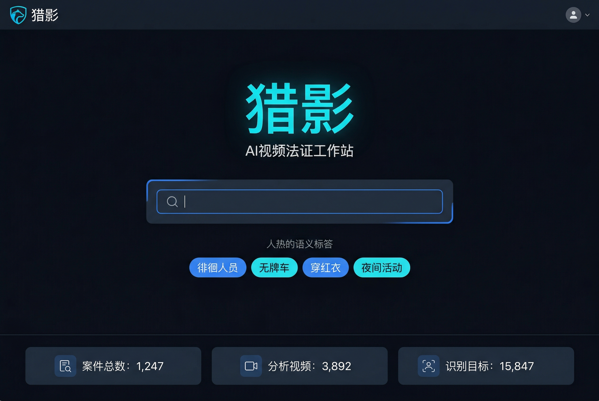
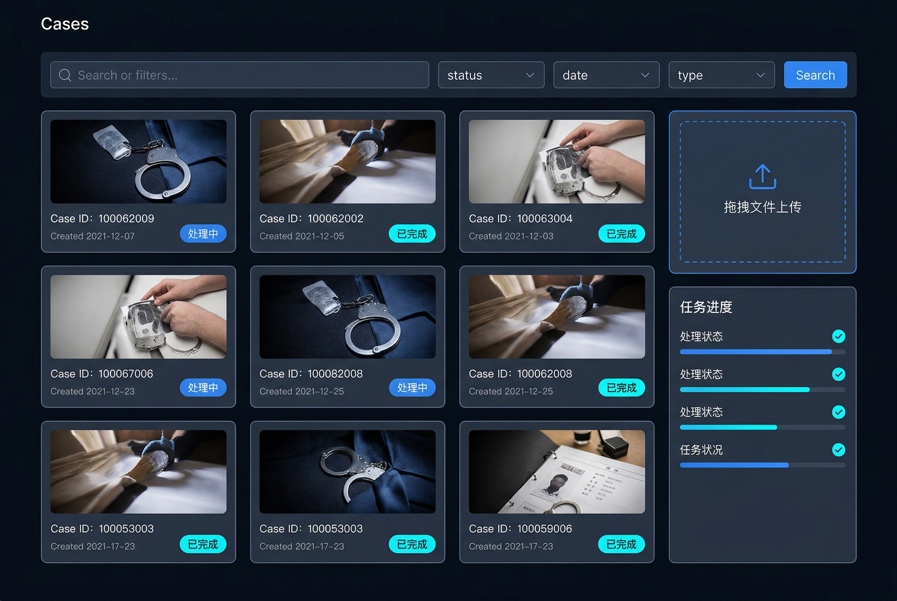
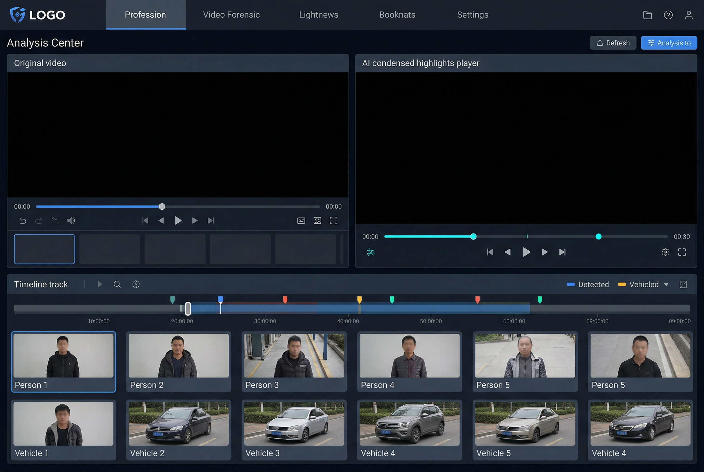
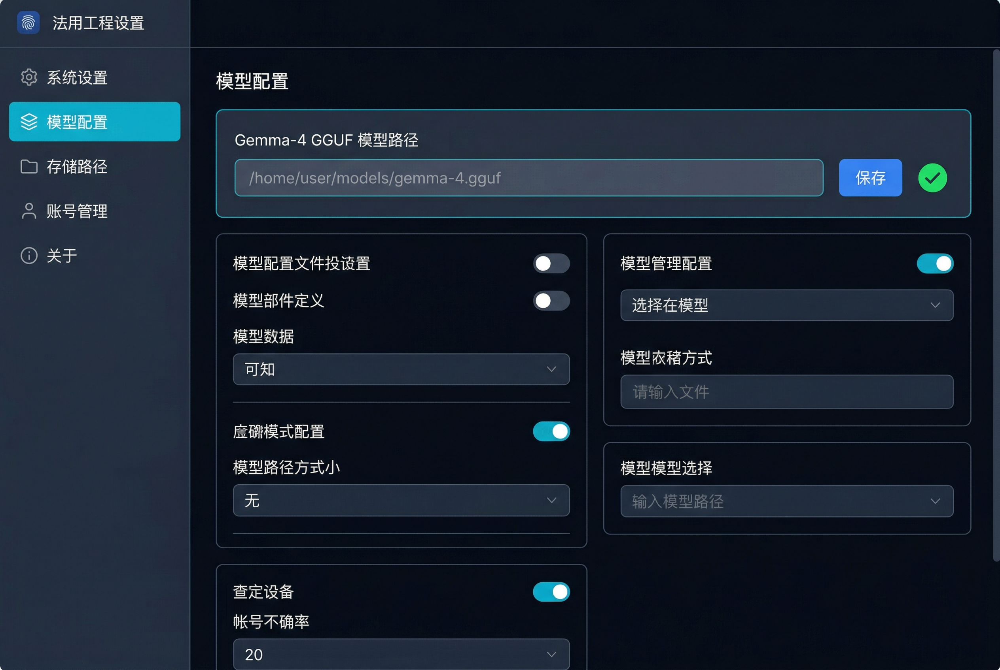
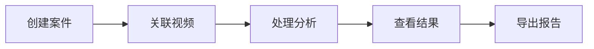

# 猎影 (Shadow Hunt) v1.0

> AI 视频法证工作站 - 智能视频分析与语义检索系统

[](https://www.python.org/)
[](https://fastapi.tiangolo.com/)
[](#许可证)

---

## 项目简介

猎影 (Shadow Hunt) 是一款面向公安、安防、司法领域的 **AI 视频法证工作站**。系统采用 **感知-认知双层架构**，支持自然语言语义检索，能够在海量监控视频中快速定位目标人物和行为轨迹。

**核心价值：**
- 🎯 **语义检索** - 用自然语言描述目标，如「正在打电话的人」「正在撬锁的人」
- 📍 **轨迹追踪** - DeepSORT 多目标追踪，跨帧锁定身份
- 🔍 **行为分析** - Grounding DINO 全语义检测，零样本识别动作
- 📊 **证据生成** - 自动生成分析报告，支持导出 PDF

## 功能特性

### 🔍 智能语义检索
- **自然语言查询** - 输入「红衣女子」「正在奔跑的人」等描述
- **多模态搜索** - 结合文本嵌入 (768维) 和视觉特征
- **快速定位** - 秒级返回匹配的时间片段和轨迹 ID

### 📍 多目标追踪
- **DeepSORT 追踪** - 卡尔曼滤波 + Re-ID 特征关联
- **轨迹可视化** - 实时绘制目标移动轨迹
- **身份锁定** - 跨帧保持目标 ID 一致性

### 🧠 行为语义理解
- **Grounding DINO 1.5** - 全语义检测，支持中英文指令
- **零样本识别** - 无需预训练标签，直接检测任意动作
- **意图推理** - Ollama (qwen3.5:9b) 语义理解

### 📹 视频处理
- **多格式支持** - MP4, AVI, MOV 等主流格式
- **异步处理** - Celery + Redis 后台任务队列
- **进度追踪** - 实时处理状态更新

### 📊 报告生成
- **PDF 报告** - 自动生成分析报告
- **截图导出** - 关键帧截图保存
- **时间标注** - 精确时间戳记录

### 🖥️ Web 前端
- **深色主题** - 专业法证界面风格
- **侧边导航** - 首页、案件、分析、设置四大模块
- **响应式布局** - 支持桌面端操作

### 🔐 安全特性
- **API Key 认证** - 所有 API 接口需认证
- **路径安全校验** - 防止目录遍历攻击
- **输入清理** - 文件名、文本提示均做安全处理
- **错误隔离** - PDO 异常不暴露给用户

## 系统架构

猎影采用 **感知-认知双层架构**，实现从「人在哪」到「他在干什么」的完整分析链路。

```
┌─────────────────────────────────────────────────────────────────────┐
│                         猎影 v1.0 系统架构                          │
├─────────────────────────────────────────────────────────────────────┤
│                                                                     │
│  ┌─────────────┐  ┌─────────────┐  ┌─────────────┐  ┌─────────────┐ │
│  │   YOLOv8    │  │  DeepSORT   │  │ Supervision │  │    FAISS    │ │
│  │  目标检测   │→│ 多目标追踪  │→│  区域分析   │→│  向量检索   │ │
│  └─────────────┘  └─────────────┘  └─────────────┘  └─────────────┘ │
│         ↓                ↓                ↓                ↓        │
│  ┌─────────────────────────────────────────────────────────────┐   │
│  │                      感知层 (Perception)                     │   │
│  │        「人在哪、去哪了、停留多久」                           │   │
│  └─────────────────────────────────────────────────────────────┘   │
│                              ↓                                     │
│  ┌─────────────────────────────────────────────────────────────┐   │
│  │                      认知层 (Cognition)                      │   │
│  │        「他在干什么、什么意图」                               │   │
│  │  ┌─────────────┐  ┌─────────────┐  ┌─────────────┐           │   │
│  │  │ Grounding   │  │   Ollama    │  │   SQLite    │           │   │
│  │  │ DINO 1.5    │→│  qwen3.5    │→│  案件存储   │           │   │
│  │  │ 全语义检测  │  │  语义推理   │  │             │           │   │
│  │  └─────────────┘  └─────────────┘  └─────────────┘           │   │
│  └─────────────────────────────────────────────────────────────┘   │
│                              ↓                                     │
│  ┌─────────────────────────────────────────────────────────────┐   │
│  │                      输出层 (Output)                         │   │
│  │  ┌─────────────┐  ┌─────────────┐  ┌─────────────┐           │   │
│  │  │  PDF报告    │  │  截图导出   │  │  Web前端    │           │   │
│  │  └─────────────┘  └─────────────┘  └─────────────┘           │   │
│  └─────────────────────────────────────────────────────────────┘   │
│                                                                     │
└─────────────────────────────────────────────────────────────────────┘
```

### 感知层组件

| 组件 | 功能 | 说明 |
|------|------|------|
| **YOLOv8** | 目标检测 | 实时检测视频中的行人、车辆等目标 |
| **DeepSORT** | 多目标追踪 | 卡尔曼滤波 + Re-ID 特征，跨帧锁定身份 |
| **Supervision** | 区域分析 | 划定区域、计数、停留时间分析 |
| **FAISS** | 向量检索 | 768维文本嵌入向量快速检索 |

### 认知层组件

| 组件 | 功能 | 说明 |
|------|------|------|
| **Grounding DINO 1.5** | 全语义检测 | 零样本检测，支持中英文自然语言指令 |
| **Ollama (qwen3.5:9b)** | 语义推理 | 动作意图理解，行为分析 |
| **nomic-embed-text** | 文本嵌入 | 768维向量，语义相似度计算 |

### 数据流转

```
视频输入 → YOLO检测 → DeepSORT追踪 → 特征提取 → FAISS索引
                    ↓
            Grounding DINO语义检测 → Ollama推理 → 结果输出
```

## 技术栈

### 核心框架
| 组件 | 版本 | 说明 |
|------|------|------|
| FastAPI | 0.110.0 | 高性能异步 Web 框架 |
| Uvicorn | 0.27.1 | ASGI 服务器 |
| Pydantic | 2.6.1 | 数据验证与序列化 |
| python-multipart | 0.0.9 | 文件上传支持 |

### 感知层 (视频处理与目标检测)
| 组件 | 版本 | 说明 |
|------|------|------|
| Ultralytics | 8.1.0 | YOLOv8 目标检测 |
| DeepSORT | 1.3.2 | 多目标追踪算法 |
| OpenCV | 4.9.0.80 | 图像处理与视频读取 |
| Supervision | 0.19.0 | 检测结果可视化 |
| PyAV | 14.0.0 | FFmpeg 视频解码 |
| ffmpeg-python | 0.2.0 | FFmpeg 命令封装 |

### 认知层 (语义理解与推理)
| 组件 | 版本 | 说明 |
|------|------|------|
| Transformers | 4.38.0 | HuggingFace 模型库 |
| llama-cpp-python | 0.2.40 | LLM 本地推理引擎 |

### 异步任务调度
| 组件 | 版本 | 说明 |
|------|------|------|
| Celery | 5.3.6 | 分布式任务队列 |
| Redis | 5.0.1 | 消息代理与缓存 |
| Kombu | 5.3.3 | 消息库抽象层 |

### 数据库与存储
| 组件 | 版本 | 说明 |
|------|------|------|
| SQLite | 内置 | 轻量级嵌入式数据库 |
| SQLAlchemy | 2.0.25 | ORM 框架 |
| Alembic | 1.13.1 | 数据库迁移工具 |

### CPU 加速
| 组件 | 版本 | 说明 |
|------|------|------|
| OpenVINO | 2024.0.0 | Intel CPU/GPU 推理加速 |
| ONNX Runtime | 1.17.0 | 跨平台推理引擎 |

### 向量检索与 Re-ID
| 组件 | 版本 | 说明 |
|------|------|------|
| FAISS | 1.7.4 | 向量相似度检索 |
| PyTorch | 2.2.0 | 深度学习框架 |
| TorchVision | 0.17.0 | 视觉模型库 |
| Torchreid | 0.2.0 | 行人重识别 |

### 认证与安全
| 组件 | 版本 | 说明 |
|------|------|------|
| python-jose | 3.3.0 | JWT 令牌处理 |
| Passlib | 1.7.4 | 密码哈希 |

### 报告生成
| 组件 | 版本 | 说明 |
|------|------|------|
| ReportLab | 4.0.8 | PDF 生成 |
| WeasyPrint | 60.2 | HTML 转 PDF |
| pdfkit | 1.0.0 | wkhtmltopdf 封装 |

## 安装部署

### 系统要求

| 项目 | 要求 |
|------|------|
| **操作系统** | Windows 10/11、Linux (Ubuntu 20.04+)、macOS 10.15+ |
| **Python** | 3.10.x (推荐 3.10.11) |
| **内存** | 16GB+ (推荐 32GB) |
| **存储** | 50GB+ 可用空间 |
| **GPU** | NVIDIA 显卡 (可选，CUDA 11.8+ 用于加速) |

> ⚠️ **注意**: Python 3.11+ 可能存在部分依赖兼容性问题，建议使用 Python 3.10

### 快速安装

#### 1. 安装 Miniconda (推荐)

下载并安装 [Miniconda](https://docs.conda.io/en/latest/miniconda.html)，用于隔离项目环境。

```bash
# Windows: 下载 .exe 安装包后双击安装
# Linux/macOS:
wget https://repo.anaconda.com/miniconda/Miniconda3-latest-Linux-x86_64.sh
bash Miniconda3-latest-Linux-x86_64.sh
```

#### 2. 创建 Conda 环境

```bash
# 创建 Python 3.10 环境
conda create -n shadowhunt python=3.10 -y

# 激活环境
conda activate shadowhunt
```

#### 3. 安装项目依赖

```bash
# 克隆项目
 git clone https://github.com/your-org/shadow-hunt.git
cd shadow-hunt

# 安装依赖
pip install -r requirements.txt

# 如需 GPU 加速，安装 CUDA 版本的 PyTorch
pip install torch torchvision --index-url https://download.pytorch.org/whl/cu118
```

#### 4. 安装 Ollama

Ollama 用于本地运行大语言模型，提供语义理解和推理能力。

**Windows:**
1. 访问 [Ollama 官网](https://ollama.com/download) 下载 Windows 安装包
2. 运行安装程序，按提示完成安装
3. 验证安装: `ollama --version`

**Linux:**
```bash
curl -fsSL https://ollama.com/install.sh | sh
```

**macOS:**
```bash
brew install ollama
```

**下载模型:**
```bash
# 启动 Ollama 服务
ollama serve

# 下载语义理解模型 (qwen3.5:9b)
ollama pull qwen3.5:9b

# 下载文本嵌入模型 (nomic-embed-text)
ollama pull nomic-embed-text

# 验证模型
ollama list
```

#### 5. 安装 Redis

Redis 作为 Celery 的消息队列和任务后端。

**Windows:**
1. 下载 [Redis for Windows](https://github.com/tporadowski/redis/releases)
2. 解压到 `C:\Redis`
3. 添加到 PATH 环境变量
4. 启动服务: `redis-server.exe`

**Linux (Ubuntu):**
```bash
sudo apt update
sudo apt install redis-server -y
sudo systemctl enable redis-server
sudo systemctl start redis-server
```

**macOS:**
```bash
brew install redis
brew services start redis
```

**验证安装:**
```bash
redis-cli ping
# 应返回: PONG
```

#### 6. 配置文件说明

配置文件位于 `config/config.yaml`，主要配置项：

```yaml
# 项目路径配置
paths:
  data: "D:/Project_ShadowHunt/data"      # 数据存储目录
  models: "D:/Project_ShadowHunt/models"   # 模型文件目录
  output: "D:/Project_ShadowHunt/output"   # 输出目录
  logs: "D:/Project_ShadowHunt/logs"       # 日志目录

# 检测模型配置
detection:
  model: "yolov8n.pt"     # YOLO 模型
  confidence: 0.5          # 置信度阈值

# 追踪配置
tracking:
  tracker: "deepsort"     # DeepSORT 追踪器
  max_age: 30              # 最大丢失帧数

# Ollama 配置
cognition:
  ollama:
    base_url: "http://localhost:11434"
    model: "qwen3.5:9b"              # 语义理解模型
    embedding_model: "nomic-embed-text"  # 文本嵌入模型

# Celery 配置
celery:
  broker: "redis://localhost:6379/0"
  backend: "redis://localhost:6379/1"
```

> 📝 **提示**: 首次运行前请根据实际环境修改 `paths` 中的目录路径

#### 7. 初始化数据库

```bash
# 确保在项目根目录
python scripts/init_db.py
```

#### 8. 启动服务

**方式一: 使用启动脚本 (Windows)**

```bash
# 双击运行 start.bat 或在终端执行
start.bat
```

启动脚本会自动：
1. 激活 Conda 环境 (`shadowhunt`)
2. 初始化数据库
3. 启动 Redis 服务
4. 启动 API 服务

**方式二: 手动启动**

```bash
# 1. 激活 Conda 环境
conda activate shadowhunt

# 2. 启动 Redis (如未运行)
redis-server --daemonize yes

# 3. 启动 Celery Worker (后台任务处理)
celery -A src.celery_app worker --loglevel=info

# 4. 启动 FastAPI 服务
python -m uvicorn src.api.main:app --host 0.0.0.0 --port 8889 --reload
```

### 访问地址

启动成功后，访问以下地址：

| 服务 | 地址 |
|------|------|
| **Web 界面** | http://127.0.0.1:8889 |
| **API 文档** | http://127.0.0.1:8889/docs |
| **ReDoc 文档** | http://127.0.0.1:8889/redoc |

### 常见问题

**Q: 启动报错 `ModuleNotFoundError`**
```bash
# 确保已激活正确的 Conda 环境
conda activate shadowhunt
# 重新安装依赖
pip install -r requirements.txt
```

**Q: Redis 连接失败**
```bash
# 检查 Redis 是否运行
redis-cli ping
# 如未运行，启动 Redis
redis-server --daemonize yes
```

**Q: Ollama 模型加载失败**
```bash
# 确认 Ollama 服务运行中
ollama serve
# 确认模型已下载
ollama list
# 手动拉取模型
ollama pull qwen3.5:9b
ollama pull nomic-embed-text
```

**Q: GPU 加速不生效**
```bash
# 检查 CUDA 是否可用
python -c "import torch; print(torch.cuda.is_available())"
# 安装 CUDA 版 PyTorch
pip install torch torchvision --index-url https://download.pytorch.org/whl/cu118
```

## API 文档

> 基础路径: `http://localhost:8080` | 完整文档: `/docs` (Swagger UI)

### 认证方式
所有 API 接口（除健康检查外）需在请求头携带 API Key：
```
X-API-Key: your-api-key
```

---

### 🔍 搜索接口

#### POST /api/search
语义搜索，支持自然语言查询。

**请求体：**
```json
{
  "query": "正在打电话的人",
  "video_id": null,
  "case_id": null,
  "top_k": 10
}
```

**响应：**
```json
[
  {
    "track_id": 1,
    "video_id": 1,
    "score": 0.92,
    "tag_value": "打电话",
    "frame_start": 150,
    "frame_end": 280,
    "confidence": 0.87
  }
]
```

#### GET /api/search/action/{action}
按动作搜索，自动拼接「正在{action}的人」。

**示例：** `/api/search/action/奔跑`

---

### 📹 视频接口

#### POST /api/videos/upload
上传视频文件。

**参数：**
- `file`: 视频文件 (multipart/form-data)
- `case_id`: 案件 ID (默认 1)

**限制：**
- 最大文件大小: 2GB
- 支持格式: MP4, AVI, MOV 等

**响应：**
```json
{
  "filename": "video_001.mp4",
  "path": "/data/raw/video_001.mp4",
  "case_id": 1,
  "size": 524288000,
  "status": "uploaded"
}
```

#### POST /api/videos/process
提交视频处理任务。

**请求体：**
```json
{
  "video_path": "raw/video_001.mp4",
  "case_id": 1,
  "semantic_prompts": ["正在打电话", "正在奔跑"]
}
```

**响应：**
```json
{
  "video_path": "/data/raw/video_001.mp4",
  "case_id": 1,
  "status": "processing"
}
```

#### GET /api/videos
列出所有视频，支持按案件筛选。

**参数：**
- `case_id` (可选): 按案件 ID 筛选

#### GET /api/videos/{video_id}
获取单个视频详情。

---

### 📁 案件管理

#### POST /api/cases
创建新案件。

**参数：**
- `name`: 案件名称

**响应：**
```json
{
  "id": 1,
  "case_number": "CASE-0001",
  "name": "测试案件"
}
```

#### GET /api/cases
列出所有案件。

---

### ⚙️ 配置管理

#### GET /api/config
获取当前配置（过滤敏感信息）。

#### PUT /api/config
更新配置项。

**请求体：**
```json
{
  "key": "cpu_threads",
  "value": "8"
}
```

**允许更新的配置项：**
- `cpu_threads` - CPU 线程数
- `memory_threshold_mb` - 内存阈值
- `box_threshold` - 检测框置信度阈值
- `text_threshold` - 文本匹配阈值

---

### ❤️ 健康检查

#### GET /api/health
服务健康状态检查（无需认证）。

**响应：**
```json
{
  "status": "ok"
}
```

---

### 🖥️ 前端页面路由

| 路径 | 页面 |
|------|------|
| `/app` | 首页 |
| `/app/login` | 登录页 |
| `/app/player` | 播放中心 |
| `/app/cases` | 案件管理 |
| `/app/settings` | 设置面板 |

## 前端界面

### 页面列表

| 页面 | 文件 | 路由 | 功能描述 |
|------|------|------|----------|
| 登录页 | `login.html` | `/login` | API Key 认证入口 |
| 首页 | `index.html` | `/` | 智能语义检索与视频上传 |
| 案件页 | `cases.html` | `/cases` | 案件管理与列表展示 |
| 分析页 | `player.html` | `/player` | 视频分析与轨迹可视化 |
| 设置页 | `settings.html` | `/settings` | 系统参数配置 |

### 设计风格

**深色主题设计** — 专为法证专业场景打造的界面风格。



#### 配色方案

| 名称 | 色值 | 用途 |
|------|------|------|
| 主背景 | `#0a1628` | 整体背景，深海蓝基调 |
| 侧边栏 | `#0d1b2a` | 左侧导航背景，略深 |
| 内容区 | `#16213e` | 主内容区背景 |
| **强调色** | `#00d9ff` | Logo、按钮、高亮、选中态 |
| 辅助强调 | `#4facfe` | 渐变起点、hover 状态 |
| 主文字 | `#e0e6ed` | 标题、正文内容 |
| 次文字 | `#7a8ba3` | 描述、次要信息、占位符 |
| 边框 | `#2a3a5a` | 分割线、输入框边框 |



### 布局结构

```
┌─────────────────────────────────────────────────────────┐
│                    侧边栏 (240px)                       │
│  ┌───────────────────────────────────────────────────┐  │
│  │                 Logo: 猎影 Shadow Hunt            │  │
│  ├───────────────────────────────────────────────────┤  │
│  │  🏠 首页                                          │  │
│  │  📁 案件                                          │  │
│  │  📊 分析                                          │  │
│  │  ⚙️ 设置                                          │  │
│  │                     (导航区域)                     │  │
│  ├───────────────────────────────────────────────────┤  │
│  │  👤 用户头像 + 用户名                              │  │
│  └───────────────────────────────────────────────────┘  │
├─────────────────────────────────────────────────────────┤
│                      主内容区 (flex: 1)                  │
│                                                          │
│    页面标题 + 操作按钮 (header)                          │
│    ─────────────────────────────────────────────────    │
│                                                          │
│                    内容区域                              │
│                                                          │
└─────────────────────────────────────────────────────────┘
```

#### 尺寸规范

| 元素 | 尺寸 |
|------|------|
| 侧边栏宽度 | `240px` (固定) |
| Logo 字体 | `24px` Microsoft YaHei |
| 页面标题 | `28px` Microsoft YaHei |
| 搜索框高度 | `48px`，圆角 `24px` |
| 主按钮 | 渐变圆角 `20px`，hover scale(1.05) |
| 标签 | `padding: 8px 16px`，圆角 `20px` |
| 内容边距 | `24px` |
| 卡片圆角 | `8px` |

### 页面功能说明

#### 🔐 登录页
- 居中登录卡片，渐变背景
- 用户名/密码输入框
- API Key 认证，登录成功后存储至 `localStorage`
- 错误提示与加载状态反馈

#### 🏠 首页
- **语义搜索框**：支持自然语言查询，如「正在打电话的人」「红衣女子」
- **快捷标签**：预设常用搜索词（奔跑的人、撬锁动作、徘徊、红衣）
- **视频上传**：点击上传按钮选择本地视频文件
- **搜索结果**：展示匹配的轨迹 ID、标签、置信度、时间范围



#### 📁 案件页
- 案件列表表格：案件编号、名称、状态、创建时间
- 状态标签：进行中（黄色）、已结案（绿色）
- 新建案件按钮（功能开发中）
- 响应式表格，hover 高亮行

#### 📊 分析页
- 视频播放器与轨迹可视化
- 目标追踪结果展示
- 关键帧截图与标注
- 时间轴导航

#### ⚙️ 设置页
- **性能设置**：CPU 线程数滑块、内存阈值输入
- **模型设置**：模型路径配置
- **加速选项**：OpenVINO、AVX-512 开关
- 保存配置/重置按钮，操作反馈状态提示



### 组件库

| 组件 | 文件 | 说明 |
|------|------|------|
| 侧边栏 | `components/sidebar.html` | 统一导航组件 |
| 主按钮 | 渐变 `#4facfe → #00f2fe` | 主要操作按钮 |
| 次按钮 | 透明 + 边框 | 次要操作 |
| 标签 | 圆角胶囊 | 搜索快捷词 |
| 开关 | Toggle Switch | 设置项开关 |
| 表格 | 深色表格 | 数据展示 |

### 技术实现

- **纯原生技术栈**：HTML5 + CSS3 + Vanilla JavaScript
- **无框架依赖**：轻量级，快速加载
- **响应式设计**：Flexbox 布局，适配桌面端
- **状态管理**：`localStorage` 存储认证 Token
- **API 通信**：`fetch` + RESTful 接口，统一 API Key 认证头

## 使用指南

### 快速开始

#### 1. 登录系统
访问 http://127.0.0.1:8889/app/login，使用默认账号登录：
- **API Key**: `dev-key-change-in-production`

登录成功后跳转到首页。

#### 2. 上传视频
点击首页右上角「📹 上传视频」按钮，选择本地视频文件（支持 MP4/AVI/MOV 格式，最大 2GB）。

上传成功后系统返回文件名和存储路径。

#### 3. 语义搜索
在搜索框输入自然语言描述，如：
- 「正在打电话的人」
- 「正在奔跑的人」
- 「红衣女子」
- 「正在撬锁的人」

或点击快捷标签直接搜索。

系统返回匹配结果，包含轨迹 ID、置信度、时间范围。

### 案件管理流程



#### 创建案件
1. 进入案件页面
2. 点击「新建案件」
3. 输入案件名称
4. 系统自动生成案件编号 (CASE-XXXX)

#### 关联视频
在视频上传时指定 `case_id` 参数，将视频归属到特定案件。

### 视频处理流程

1. **上传** → 视频保存到 `data/raw/` 目录
2. **处理** → 后台 Celery 任务异步处理
   - YOLO 检测目标
   - DeepSORT 追踪轨迹
   - 提取特征向量
   - Grounding DINO 语义检测
3. **索引** → 结果存入 SQLite + FAISS
4. **检索** → 语义查询快速匹配

### 常见问题 (FAQ)

**Q: 搜索结果为空怎么办？**
- 检查视频是否已处理完成
- 尝试更精确的描述词
- 降低置信度阈值（设置页面）

**Q: 视频处理时间过长？**
- 视频长度影响处理时间
- 可在设置页面调整 CPU 线程数
- 启用 OpenVINO 加速

**Q: 如何导出分析结果？**
- 进入分析页面
- 点击「导出报告」按钮
- 选择 PDF 格式保存

### 测试用例参考

| 测试场景 | 输入 | 预期结果 |
|---------|------|----------|
| 语义搜索 | 「正在打电话的人」 | 返回包含打电话动作的轨迹 |
| 视频上传 | 10MB MP4 文件 | 上传成功，返回文件名 |
| 大文件上传 | 3GB MP4 文件 | 拒绝上传，提示文件过大 |
| 无认证请求 | 不携带 X-API-Key | 返回 401 错误 |
| 健康检查 | GET /api/health | 返回 `{"status": "ok"}` |

## 开发团队

**97工作室 (97 Studio)**

| 成员 | 角色 | 职责 |
|------|------|------|
| 🤖 **贾维斯** | 首席架构师 | 需求分析、方案设计、文档编写 |
| 🖥️ **星期五** | 程序员 | 前后端开发、API 实现 |
| 🧪 **马克** | 测试工程师 | 测试用例、质量保障 |
| 🔍 **托尼** | 代码审计 | 安全审计、性能优化 |
| 🎨 **小辣椒** | UI/UX 设计师 | 前端界面设计 |
| 🔧 **班纳** | 运维专家 | 部署文档、环境配置 |

### 开发流程

```
需求 → 贾维斯分析 → 星期五编码 → 托尼审计 → 马克测试 → 小辣椒 UI 审核 → 发布
```

## 许可证

本项目采用 **MIT 许可证** 开源。

```
MIT License

Copyright (c) 2026 97 Studio

Permission is hereby granted, free of charge, to any person obtaining a copy
of this software and associated documentation files (the "Software"), to deal
in the Software without restriction, including without limitation the rights
to use, copy, modify, merge, publish, distribute, sublicense, and/or sell
copies of the Software, and to permit persons to whom the Software is
furnished to do so, subject to the following conditions:

The above copyright notice and this permission notice shall be included in all
copies or substantial portions of the Software.

THE SOFTWARE IS PROVIDED "AS IS", WITHOUT WARRANTY OF ANY KIND, EXPRESS OR
IMPLIED, INCLUDING BUT NOT LIMITED TO THE WARRANTIES OF MERCHANTABILITY,
FITNESS FOR A PARTICULAR PURPOSE AND NONINFRINGEMENT. IN NO EVENT SHALL THE
AUTHORS OR COPYRIGHT HOLDERS BE LIABLE FOR ANY CLAIM, DAMAGES OR OTHER
LIABILITY, WHETHER IN AN ACTION OF CONTRACT, TORT OR OTHERWISE, ARISING FROM,
OUT OF OR IN CONNECTION WITH THE SOFTWARE OR THE USE OR OTHER DEALINGS IN THE
SOFTWARE.
```

---

*版本: 1.0.0 | 更新时间: 2026-04-07*